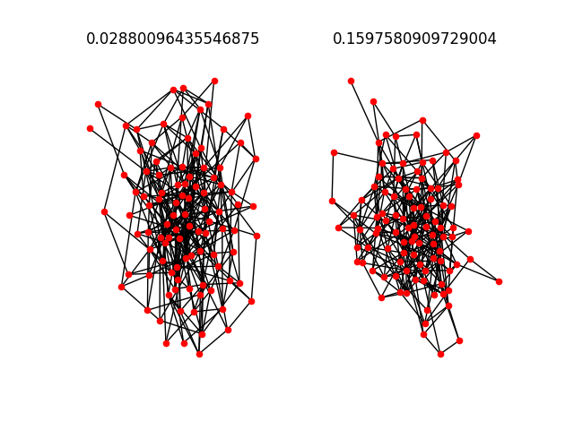
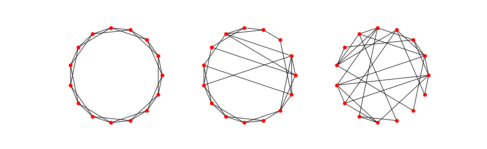
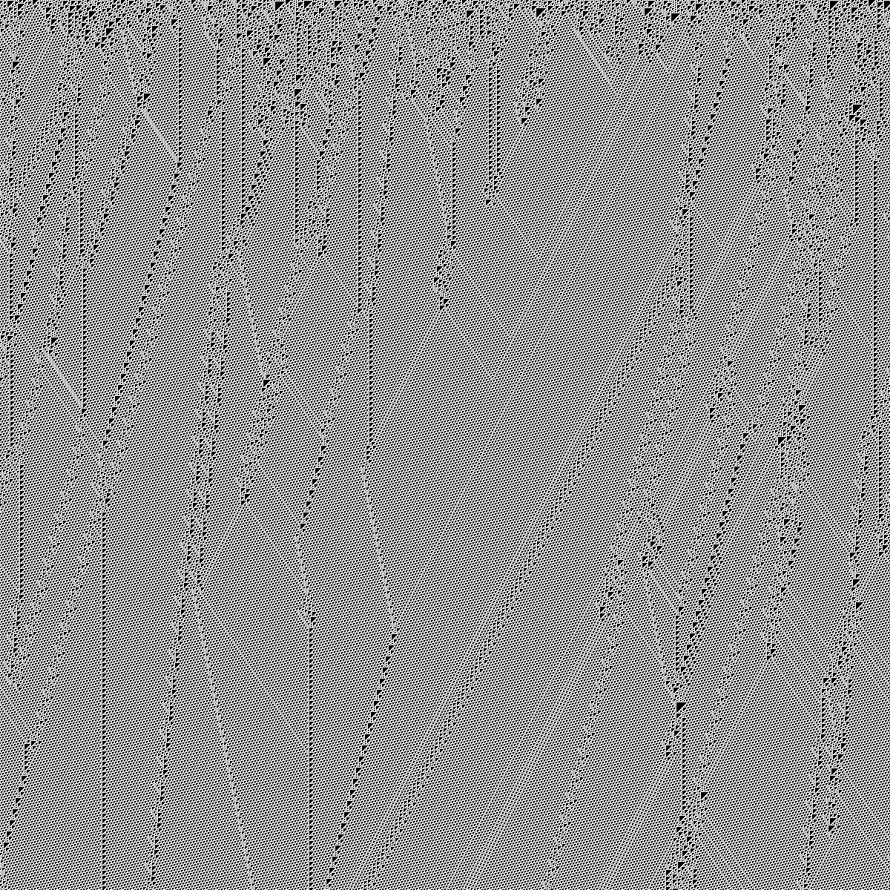
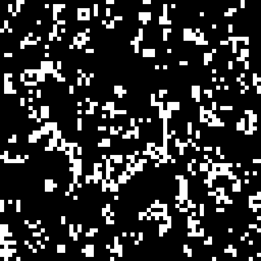
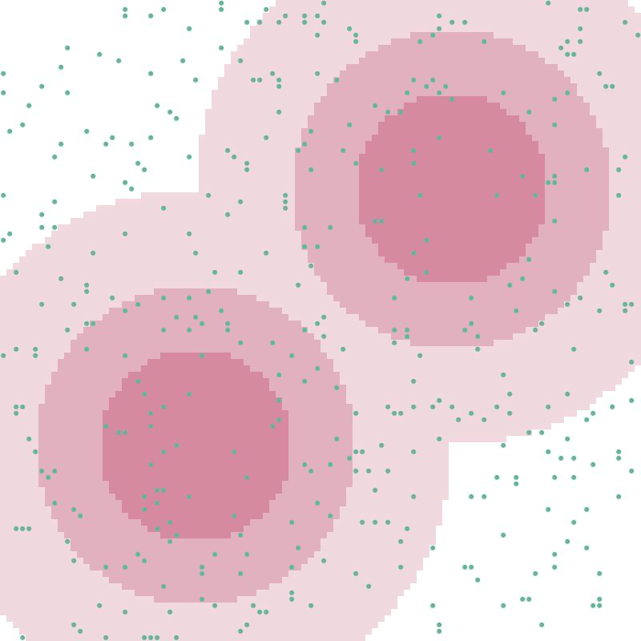
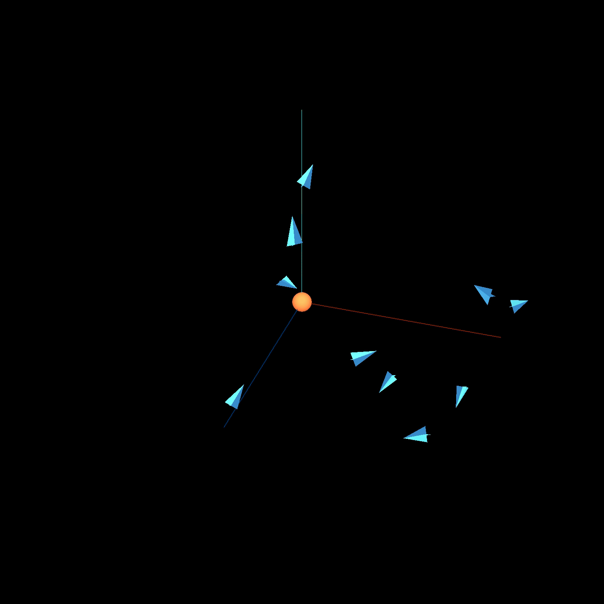

# think-complexity

Taichi implementation for book Think Complexity

## TODO

- [x] ER Graph
- [x] WS Graph
- [x] Cellular Automaton
- [x] Game of Life
- [x] Reaction Diffusion
- [x] Sand Piles
- [x] Schelling
- [x] Sugarscape
- [x] Boids
- [ ] Mutant
- [ ] Prisoner's dilemma

## Graph

### ER Graph

### WS Graph

## Grid

### Cellular Automation

### Game of Life

### Sand Piles

## Agent

### Schelling

### Sugarscape

### Boids

## Evolution

### Mutant

NK model is a mathematical model by Stuart Kauffman has tunable rugedness. It caputres the intuition over the size of landscapes, can be adjusted via 2 parameters $N$ and $K$, with $N$ being the length of a string of evolution and $K$ the level of landscape ruggedness.

- NP-complete problem
- Open-ended evolution

#### Results

#### Papers

- [Stuart Kauffman, Simon Levin, Towards a general theory of adaptive walks on rugged landscapes, Journal of Theoretical Biology, Volume 128, Issue 1, 1987, Pages 11-45.](https://doi.org/10.1016/S0022-5193(87)80029-2)

## Reference

- [Book and Code for Think Complexity](https://github.com/AllenDowney/ThinkComplexity2)
